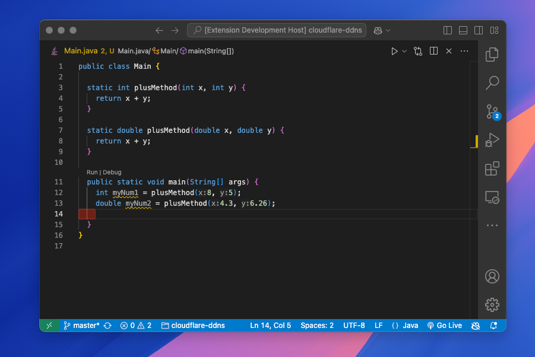

# Userguide to the Log Assistant Tool

## Table of Contents

- [Userguide to the Log Assistant Tool](#userguide-to-the-log-assistant-tool)
  - [Table of Contents](#table-of-contents)
  - [1. Introduction](#1-introduction)
  - [2. Setup](#2-setup)
  - [3. Getting Started](#3-getting-started)
  - [4. Using the Extension](#4-using-the-extension)
    - [4.1 Create an AI Learning Model](#41-create-an-ai-learning-model)

## 1. Introduction

Welcome to the user guide for the "Log Assistant Tool" extension, designed to suggest line of code to improve the logging density for a given Java file. This guide will help you get started with the tool.

The log assistant tool is a functionality of the log density analyzer tool that provides suggestions to improve the logging density in Java files. It uses a large language model that runs in Ollama to generate log advice at the line of code level. The tool is designed to help developers understand and optimize their logging practices.

## 2. Setup

Make sure you have followed the installation guide to install the extension.

## 3. Getting Started

1. Launch the extension by pressing the F5 key or by running the extension in **Run & Debug** or `npm start`.
2. An new window will open with the extension running.
3. Open the desired Java file, it should look like this : 

## 4. Using the Extension

### 4.1 Create an AI Learning Model

Before using the log assistant tool, you need to make sure there is a model running in the ollama service. You can either use the default model in Ollama or download the one you want to use.

To use the default model in Ollama:

