# User Guide for the "Log Density Tool" Extension

## Table of Contents

- [User Guide for the "Log Density Tool" Extension](#user-guide-for-the-log-density-tool-extension)
  - [Table of Contents](#table-of-contents)
  - [1. Introduction](#1-introduction)
  - [2. Setup](#2-setup)
  - [3. Getting Started](#3-getting-started)
  - [4. Using the Extension](#4-using-the-extension)
    - [4.1 Create an AI Learning Model](#41-create-an-ai-learning-model)
    - [4.2 Analyze a JAVA file to get the appropriate logging density](#42-analyze-a-java-file-to-get-the-appropriate-logging-density)
    - [4.3 Analyze multiple JAVA files to get the appropriate logging density](#43-analyze-multiple-java-files-to-get-the-appropriate-logging-density)

## 1. Introduction

Welcome to the user guide for the "Log Density Tool" extension, designed to suggest the appropriate logging density for a given Java file. This guide will help you get started with the tool.

## 2. Setup

- Run `npm install` in the "logdensitytool" folder to enable the extension.

## 3. Getting Started

- Launch the extension by pressing the F5 key.

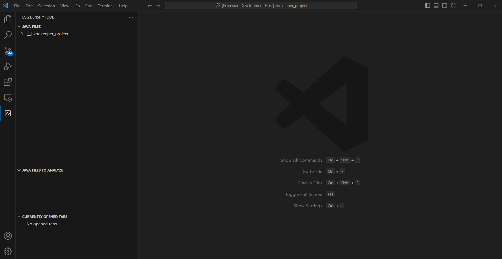

## 4. Using the Extension

### 4.1 Create an AI Learning Model

- Access the command menu from the search bar by pressing Ctrl + Shift + P.

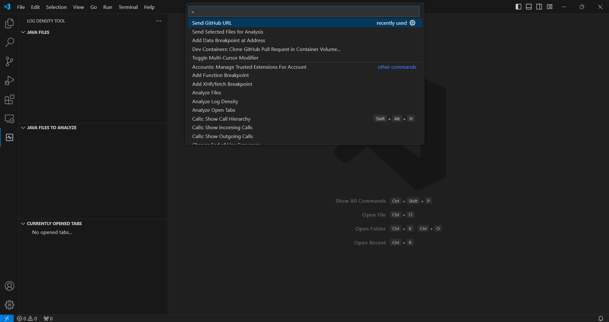

- Type "Send GitHub URL" in the search bar and select this option.

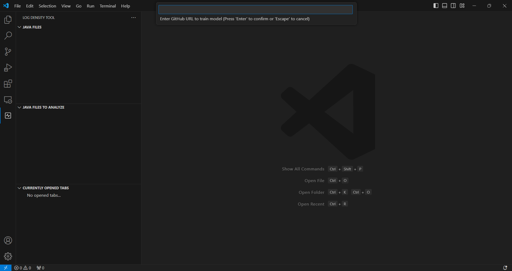

- Enter the URL of a GitHub project. If a model has already been trained on the same project, it will not train again, and a message will notify the user that the model is already trained.

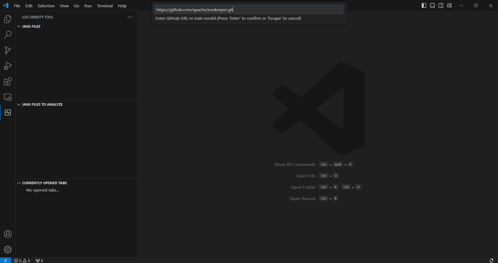

- Wait for the model training to complete. Once completed, the trained model files can be found in the "training_data" subfolder of the "services" folder in the file explorer.

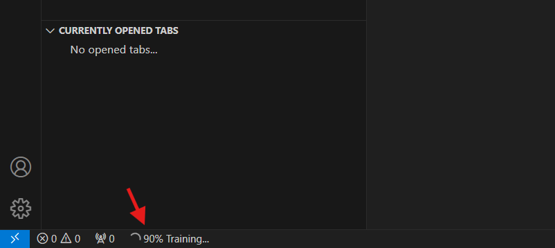

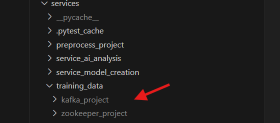

### 4.2 Analyze a JAVA file to get the appropriate logging density

- Open the trained project by clicking on "Open Folder" and selecting its folder in `training_data`.

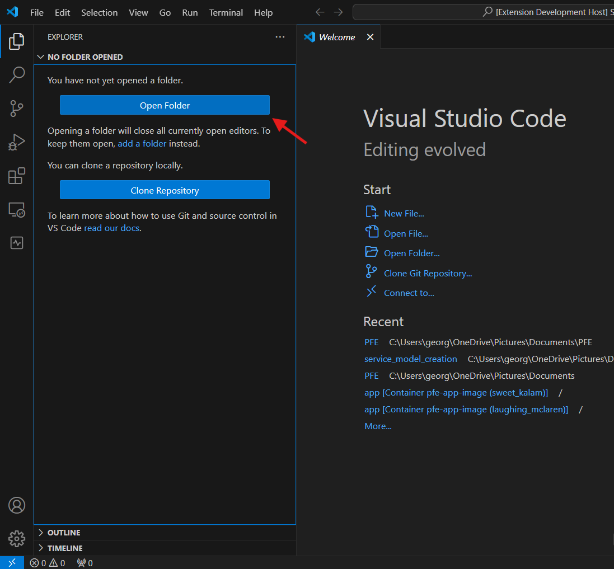

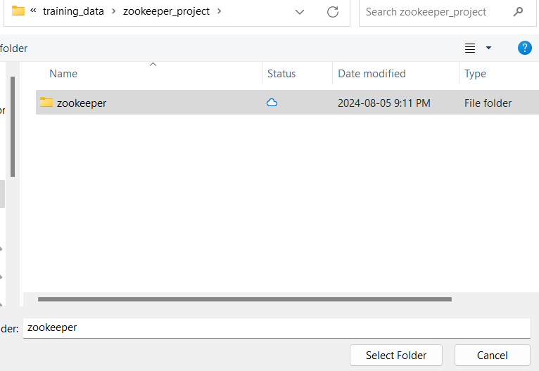

- Open the desired JAVA file by clicking on it in the file explorer in the window opened after pressing F5 at the start.

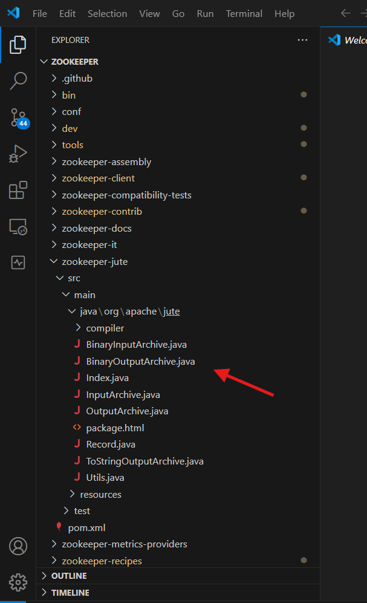

- View the current and desired densities displayed as categories in the opened file. The analysis occurs automatically when opening the file. It is possible to see the opened files in the "CURRENTLY OPENED TABS" view and perform an analysis to obtain current and desired densities in numbers by clicking on "Analyze Open Tabs."

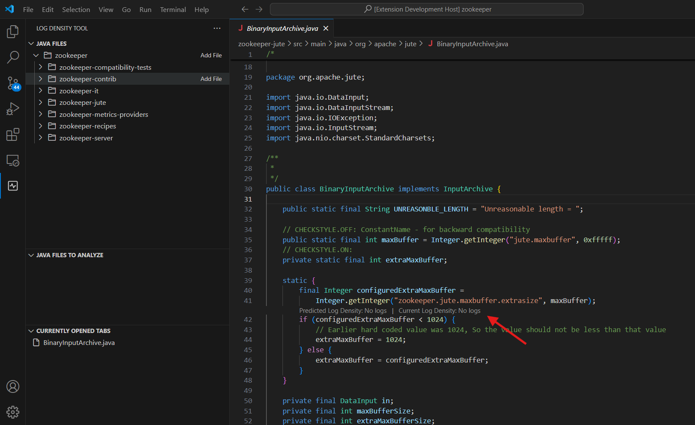

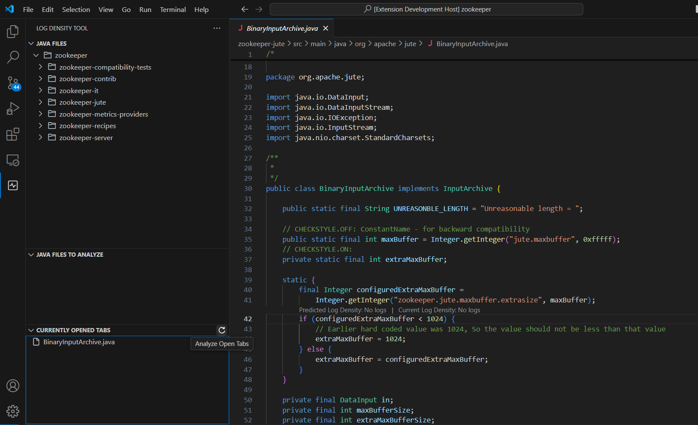

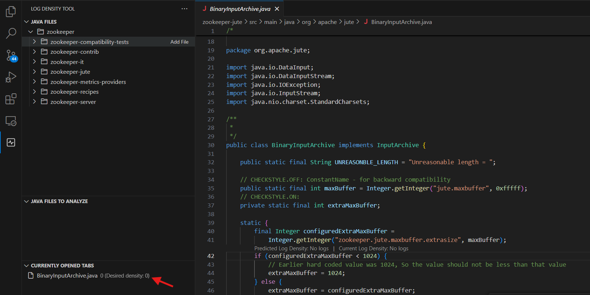

### 4.3 Analyze multiple JAVA files to get the appropriate logging density

- Open the trained project by clicking on "Open Folder" and selecting its folder in `training_data`.

- Select "Add File" to choose the JAVA file(s) or folder(s) to analyze in the "JAVA FILES" view. If a folder is selected, all JAVA files in its subfolders are also added. The added files or folders appear in the "JAVA FILES TO ANALYZE" view.

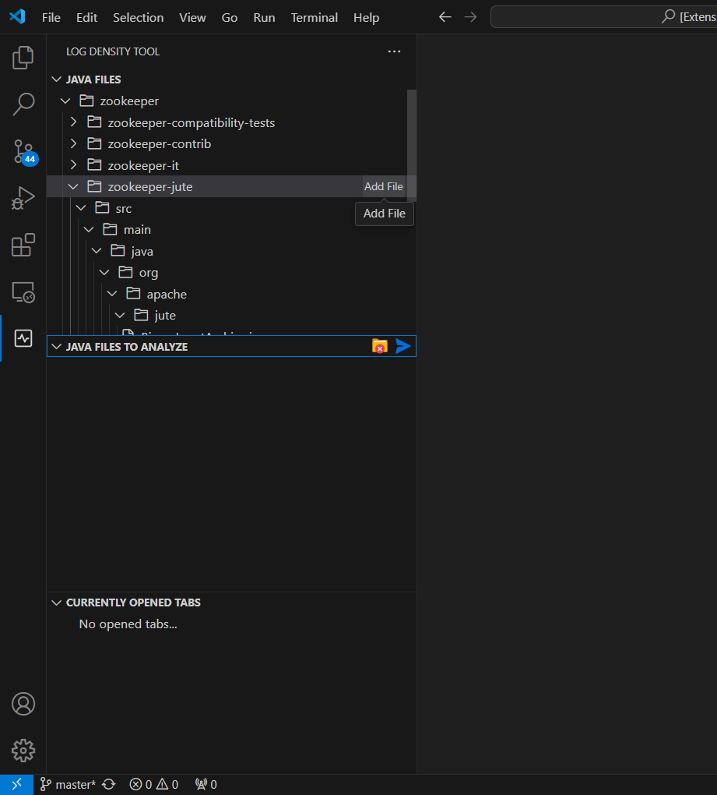

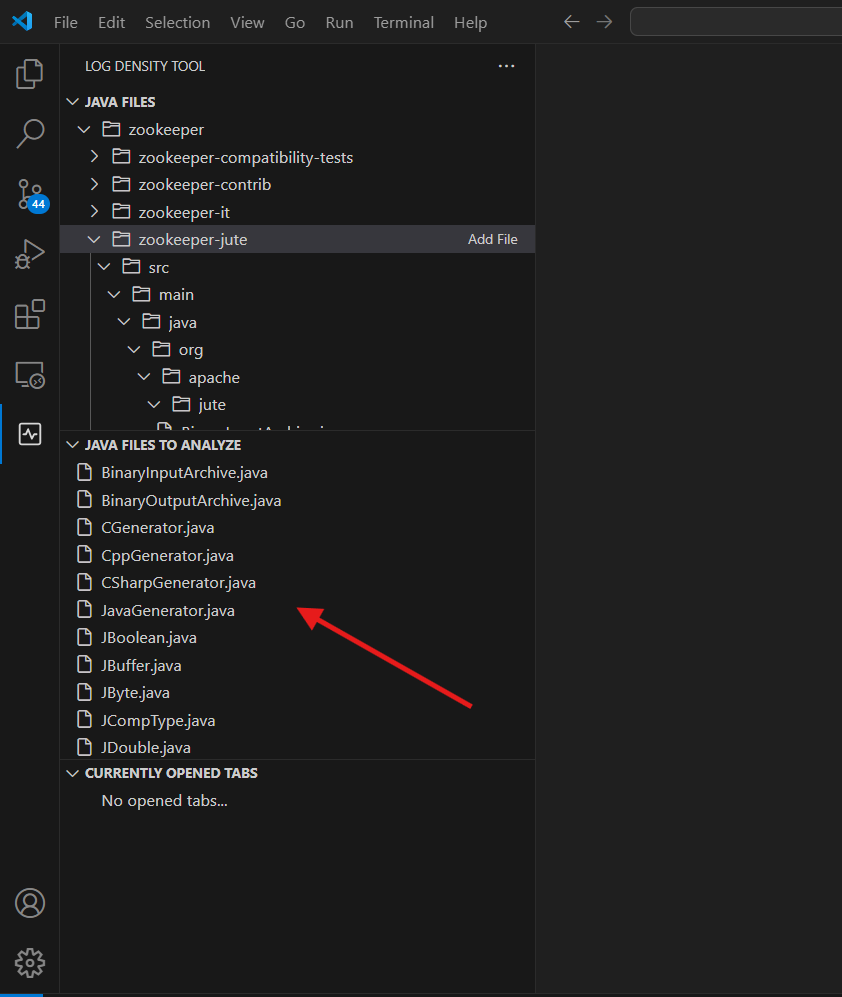

- Remove a file if needed by clicking "Remove File." It is also possible to remove all files by clicking "Remove All Files."

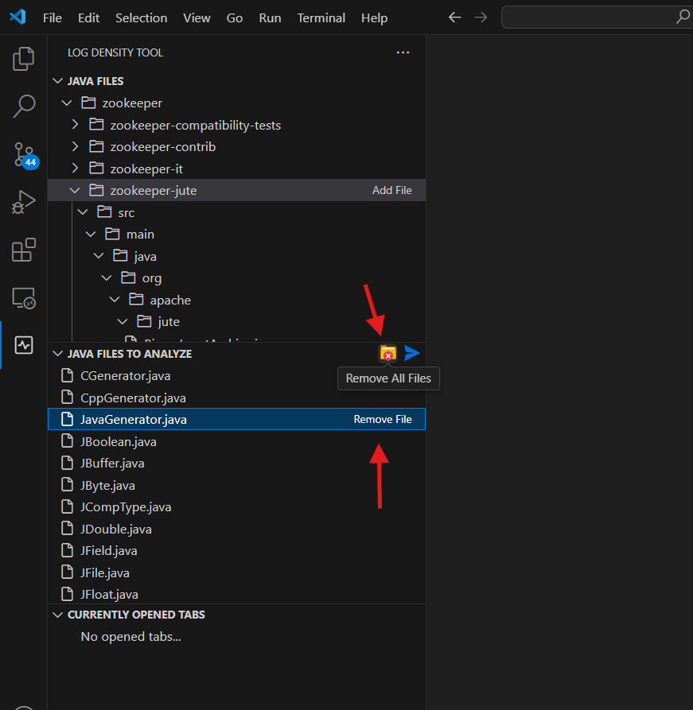

- Start the analysis by clicking the blue arrow icon "Send Selected Files for Analysis." The densities, displayed as numbers, will be visible in the "JAVA FILES" view. A color-coded icon appears next to the analyzed files. These colors range from "Low" to "High." "Low" is indicated by green, "Medium" by yellow, and "High" by red. They represent the difference between the current and suggested densities. If the difference is small, the color is green, and the logic follows for the other colors.

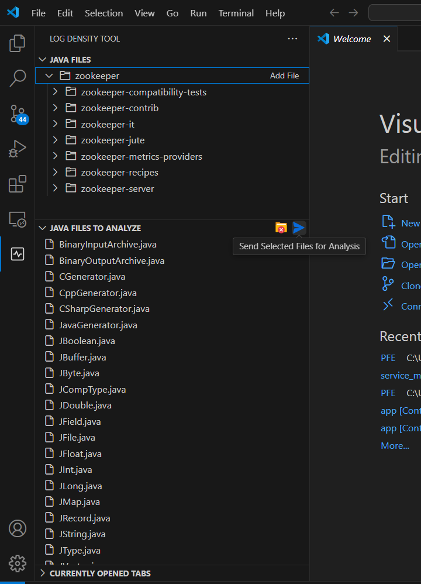

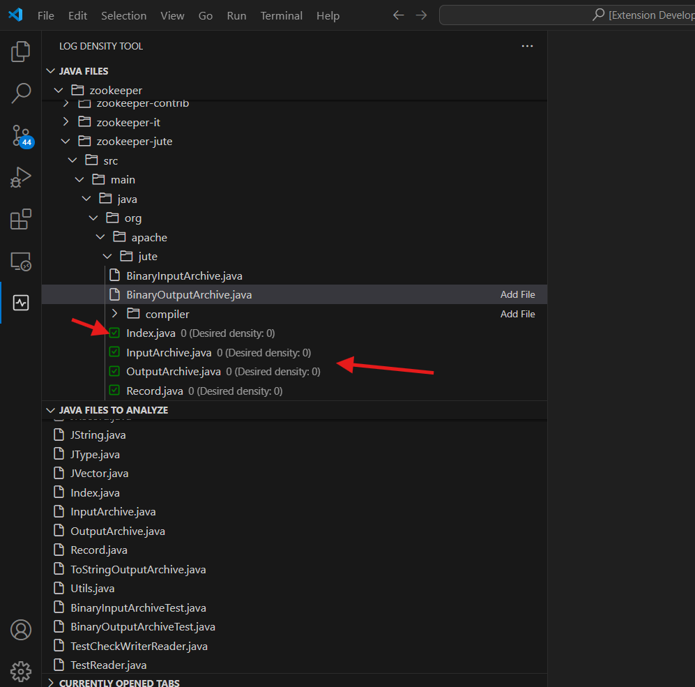
